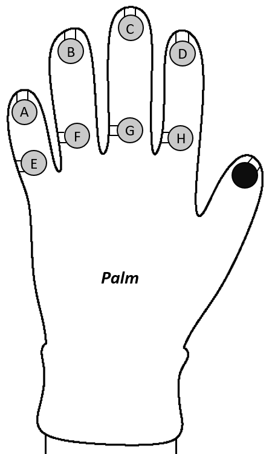

# Designing and Manufacturing a Data Glove

This project focuses on the design and manufacturing of an electronic 'Data Glove', upon development of the glove we then need to give it a purpose, for this project we decided that the glove should mimic a computer keyboard, where the user can input characters into a program by using sensors attatched to the glove. So for the project it is split into two sections, hardware development and software development. _This glove has been developed to send user inputs to a computer server, via a Rasperry Pi Zero W, in the form of UDP packets._ 

This file provides technical documentation for my project. It includes:
* A discussion of the design and implementation of the data glove.
* How to install this project's supporting software, and linking it to the hardware.

# Design and Implementation
The following section of this readme goes through the design and implementation of the Data Glove, the first section being hardware focused, followed by the software focused section.

## Hardware
This sections goes into detail about how I have created my Data Glove, including what components have been used, hardware and tecnhical achievements made, and ending with a discussion of the design of the glove itself. 

### Circuit Diagram

Using the following circuit diagram, I created, I was able to produce a circuit that would imitate the circuit that would need to be implemented on to the glove. This circuit was created by me from scratch, with help in understanding the circuitary foundations from Dahl [1].   

Figure 1. 

Upon creation of this circuit I was then challenged with implementing this circuit on a Rasperry Pi, this did prove tricky in the beggining of the project, however, using the Raspberry Pi Cookbook [3] I was able to produce simpiler circuits with supporting code, e.g. managing the state of a lightbulb connected to the Raspberry Pi, as seen [here](https://cseegit.essex.ac.uk/ce301_2020/ce301_taylor_ryan_j/-/blob/e30161099221c3c7f1ebe415bf5a1ea35952a78e/Starter_Work/Images/Button_LED.MP4). With the knowledge gained from this source I was able to succesfully reproduce the circuit diagram shown in Figure 1 with a Raspberry Pi.

### Glove Design
Over the course of this project I have gone through many different designs for my Data Glove, making improvements over each iteration, examples of these designs can be found [here](Images/). 
Importantly, Figure 2, seen below, shows the final iteration of my glove design, this was produced largely in the Autumn Term with the intention being to use the design to create my data glove in the Spring Term. 


Figure 2. 

Components Needed to reproduce my glove:
* Raspberry Pi Zero W * 1
* 10 kΩ Resistor * 1
* MPU 6050 Accelerometer * 1
* 10000 mAh Power Bank * 1
* Clothes Poppers * 9 
* Wires
* Connector
* Conductive Cloth
* A tight fitting glove

### Glove Configuration
Below, in Figure 3, is the standard configuration that my glove uses, when run in parallel with my software it will produce the following outputs when the sensor is in contact with the black sensor.


Figure 3. 

| Symbol | Description |
| ------ | ------ |
| A | Inserts the first character in the set of keys e.g. 'a' or '1'. |
| B | Inserts the second character in the set of keys e.g. 'b' or '2'. |
| C | Inserts the third character in the set of keys e.g. 'c' or '3'. |
| D | Changes to the next set of keys. e.g ['a', 'b', 'c', 'd', 'e'] --> ['f', 'g', 'h', 'i', 'j'] |
| E | Inserts the fourth character in the set of keys e.g. 'd' or '4'. |
| F | Inserts the first character in the set of keys e.g. 'e' or '5'. |
| G | Inserts a 'space' variable. |
| H | Changes to the next keyset e.g. ['a', 'b', 'c', 'd', 'e'] --> ['1', '2', '3', '4', '5'] |

## Software
The following section details the software side of this project, how the software has been created and how it links to the hardware.

### Program Design
For this project, the software is split into two different parts, the input and output.

The input for this project is **rpi-main.py**, a program written in Python 3 with the intention being to capture user inputs from my data glove and then manipulating these inputs to create an output. This program makes use of the following libraries:
* RPI.GPIO
* socket
* time

The input program achieves this by using the GPIO board [2], built on to the Raspberry Pi Zero W.
Based initially on software available in the Raspberry Pi Cookbook [3], to gather readings from the Raspberry Pi, to then be controlled and manipulated in Python. The program has been modified heavily to gather multiple readings and transfer these readings into a readable format.
A representation of this program's logic can be seen in Figure 4, below.


Figure 4.

The output for this project is **server-main.py**, a program that outputs the user's input to the console in the form of keystrokes, controlled by data gathered from the data glove. The program is written in Python 3 and makes use of the socket library. To succesfully transfer data between the input and output programs I have used UDP packets, the starting program for this is a combination of data found in the Foundations of Python network programming book [4], CE303: Labratory Work 4 [5] and Python.org [6]. The logic for this program can be found below, in Figure 5.


Figure 5.


### Error Handling
In my programs there are calls to different error handling structures, in the input program these include:
- Catching an errors and printing them to the console.

In the output program these include:
- A system to ensure that when reaching the end of the set of keysets it loops back to the first initial keyset.
- Similarly a system is in place to loop around when you reach the end of a keyset e.g. ['X', 'Y', 'Z'] -> ['A', 'B', 'C'].
- Building on from the previous systems, another system needed to be implemented to ensure that when calling a key it actually exists. This was need as some keysets are of different lenghts, meaning that when indedxing the key there might not be an actual key assigned, so for, indexing a key that did not exist would be fatal and break the program.
- Any other errors are caught in a try statement and outputted in the console.


#### Key Debouncing
For the input program I was tasked with the issue of key debouncing, where in short, the sensors would send multiple readings to the Raspberry Pi in a short amount of time. This is described in details by Ganssle [7]. How I combatted this problem was to implement two pieces of code to my program, the first being the time.sleep() function, which when called would make the input program wait after an input signal is detected, and pairing this with a internal 'pull-up' resistor built into the code. Together these pieces of worked to produce the required input/output.

#### KeySets
Implemented into this software are three different keysets, with expansion available for more, these inclue:
- Lower-case english alphabet.
- Numerics from 0-9.
- Punctuation.

## Installing the Software
This sections goes into detail about how to get my project working, most importantly using the glove to create an output.

### Prerequisites
* Python 3.5 (or later)
* My Data Glove, running Raspbian 5.0 (or later)
* A System Running Windows 10 

### Install relevant Libraries
As mentioned earlier, this project makes use of the RPI.GPIO library. This package usually exists on a working version of Raspbian and can be installed using the following commands in a new terminal:
```
sudo apt-get update

```
Followed by:
```
sudo apt-get install rpi.gpio

```
**The other libraries are built straight into Python 3.5, so we do not need to install them.**

### Using the Project Software
As mentioned, the data glove's supporting sotware is split into two files, and can be found in my git [repository](https://cseegit.essex.ac.uk/ce301_2020/ce301_taylor_ryan_j/-/tree/master/Code):
* **rpi-main.py**, this file should be located in the **Raspberry Pi's** Desktop folder.
* **server-main.py**, this file should be located in the **Windows 10** Desktop folder.

#### Edit the files
In the following files, change the line of code to match the ipv4 address of your windows device, followed by an unused port number, and save the changes:

##### rpi-main.py / Line 23
```
sock.sendmsg(("192.168.1.180, 1234"))

```
##### server-main.py / Line 15
```
s.bind(("192.168.1.180, 1234"))

```

After these changes to the code have been made, refer back to the Raspberry Pi. To make the **rpi-main.py** program runnable we must first make it executable. In a new terminal, run the following command:
```
chmod +x rpi-main.py
```

#### Executing the Software

Now that we have succesfully configured the programs, we want to produce an output. To run my project, you must first run the **rpi-main.py** file, this can be done by entering the following command in the same terminal you just opened:
```
./rpi-main
```
If all is succesful, you will be greeted with a "Program Starting..." message.

Next, we need to run the **server-main.py** program. As this is located on a Windows environment it is just a task of running the program in the python shell. If all is well you should be greeted with a "Server Open..." message.

Using the Data Glove we should now be able to create an output in the form of keystrokes from input gathered from the Raspberry Pi. A full demonstation of my project working can be found [here](https://cseegit.essex.ac.uk/ce301_2020/ce301_taylor_ryan_j/-/blob/c1016dae4c011bd6a426e83eea5579fc45ab7afc/product-demo.mov)


## Author
* Ryan J Taylor - Computer Science

## References

[1] buildelectronicscircuits, Øyvind Nydal Dahl, [Online]. Available: https://www.build-electronic-circuits.com/how-to-learn-electronics/. [Accessed: 10- Sept- 2020].
[2] GPIO - "GPIO - Raspberry Pi Documentation", Raspberrypi.org. [Online]. Available: https://www.raspberrypi.org/documentation/usage/gpio/. [Accessed: 20- Sept- 2020]. \
[3] RPi - S. Monk, Raspberry Pi Cookbook, 1st ed. California: O’Reilly Media, 2013, pp. 167-184, 203-215, 265-270, 297-300. \
[4] Sockets - J. Goerzen, Foundations of Python network programming. Berkeley: Apress, 2004, pp. 1-17. \
[5] Cloning, Serialisation, Sockets, Dr. Michael Kampouridis: Advanced Programming, Lecture Notes, University of Essex (2020): https://moodle.essex.ac.uk/mod/resource/view.php?id=685144. [Accessed: 22- Nov- 2020]. \
[6] UDP Communication, Python.org. [Online]. Available: https://wiki.python.org/moin/UdpCommunication [Accessed: 20- Sept- 2020]. \
[7] J. Ganssle, A Guide to Debouncing, 2nd rev. 2007, pp. 1-22.9


